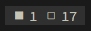

# Tmux Docker

This `tmux` plugin creates a simple count of your running and non-running
(exited) Docker containers.




## Usage

Add `#{docker_status}` to your `status-left` or `status-right`:

```
set -g status-right '#{docker_status} %a %Y-%m-%d %H:%M'
```


## Installation

1. Install [Tmux Plugin Manager][tpm].

2. Add this plugin to your `~/.tmux.conf`:

```
set -g @plugin 'chriszarate/tmux-docker'
```

3. Press [prefix] + `I` to install.


## Configuration

The following configuration variables can be set in your `~/.tmux.conf` (shown
here with their default values):

```
# Colors
set -g @docker_format_begin '#[fg=white,bg=colour236]'
set -g @docker_format_end '#[fg=white,bg=black]'

# Icons
set -g @docker_icon_running '◼ '
set -g @docker_icon_stopped '◻ '
```

[tpm]: https://github.com/tmux-plugins/tpm
